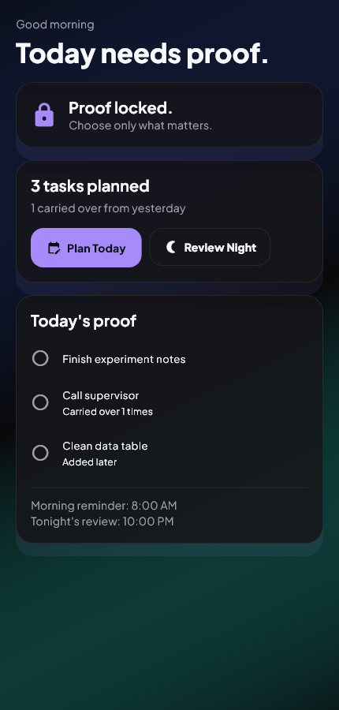
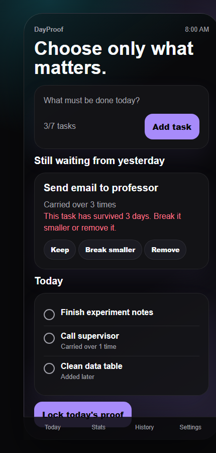
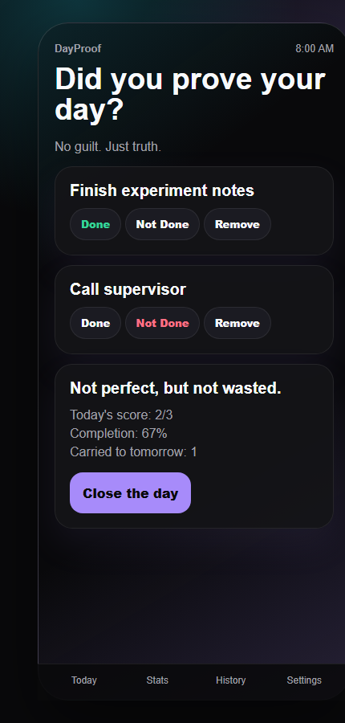
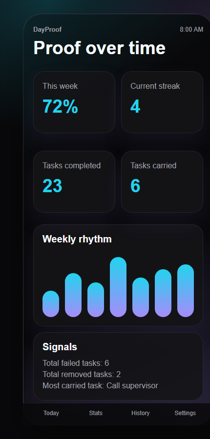
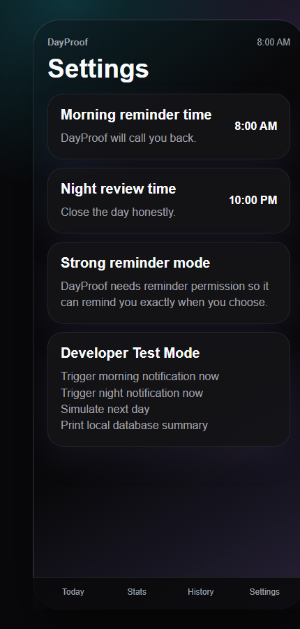

# DayProof

**Prove your day before it disappears.**

DayProof is a small Android app for the two moments where a day usually goes honest or vague: the morning plan and the night review.

In the morning, you write down the few things that would actually make the day count. At night, you come back and mark what happened. Done stays done. Not done carries into tomorrow. Anything that no longer matters can be removed without pretending it was completed.

The point is not to manage every little task. It is to keep a quiet record of whether the important things survived the day.

## Screenshots

| Today | Plan | Review |
| --- | --- | --- |
|  |  |  |

| Stats | Settings |
| --- | --- |
|  |  |

## Why It Exists

Most to-do apps make it easy to keep adding things. DayProof tries to do the opposite. It asks for a short list, locks the day, and then brings the same list back at night.

If something keeps coming back for three days, the app points it out. Maybe it needs to be broken smaller. Maybe it should be removed. Either way, it should not quietly haunt the list forever.

## What Is Built

- First-run onboarding for morning and night reminder times.
- Morning planning with editable tasks before the day is locked.
- Carry-over tasks from the previous night.
- Emergency tasks after locking, marked as added later.
- Night review with Done, Not Done, and Remove.
- Automatic carry-over for tasks marked Not Done.
- History for previous days.
- Simple stats for completion, streaks, completed tasks, carried tasks, and most-carried task.
- Settings for reminder times, notifications, strong reminder mode, max tasks, JSON export, reset onboarding, and clearing data.
- Hidden developer test mode by tapping the app version seven times.

## Privacy

DayProof is local-first. There is no account, backend, Firebase project, cloud sync, ads, or social layer. The data lives on the device through Hive local storage.

## Tech

- Flutter
- Hive
- flutter_local_notifications
- timezone
- permission_handler
- google_fonts
- flutter_animate
- confetti

## Run It

```powershell
flutter pub get
flutter run
```

## Build The APK

```powershell
flutter clean
flutter pub get
flutter analyze
flutter test
flutter build apk --release
```

Release APK from Flutter:

```text
build/app/outputs/flutter-apk/app-release.apk
```

Copied release artifact in this repo:

```text
release/dayproof-release.apk
```

Debug APK artifact:

```text
release/dayproof-debug.apk
```

## Reminder Behavior

DayProof uses normal Android notifications. It does not try to force-open itself in the background. The morning reminder opens planning when tapped, and the night reminder opens review when tapped.

On Android 13 and newer, notification permission is requested. If the user says no, the app still works manually.

Strong reminder mode can request exact alarm permission. The app explains it like this:

> DayProof needs reminder permission so it can remind you exactly when you choose. Without it, reminders may arrive a little late depending on your phone settings.

If that permission is unavailable or denied, DayProof falls back to normal scheduled reminders.

## Project Shape

```text
lib/
  app.dart
  main.dart
  core/
  data/
  services/
  features/
  shared/
```

The feature folders are split around the actual screens: onboarding, today, stats, history, and settings.

## License

Private project for now.
